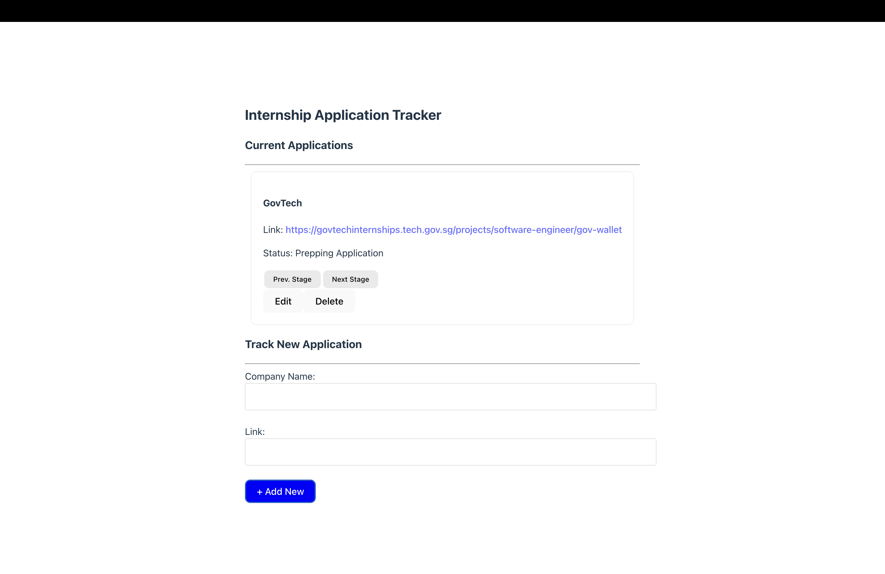

# Internship-Application-Tracker
A full-stack web application for tracking internship and job applications with status progression and CRUD functionality. Doubles as a Self-directed learning project to learn React, FastAPI, and SQL

---

## Overview

This project helps students track their internship applications and manage the progress of each application from preparation to final decision.

---

## Tech Stack

Frontend:
- React

Backend:
- FastAPI

Database:
- SQLite
- SQLAlchemy ORM

Other Tools:
- Python
- JavaScript
- REST APIs

---

## Features

- Add new job applications
- Edit application details
- Delete applications
- Track status progression
- Status transitions (Prepping Application → Applied → Interview → Accepted / Rejected)

---

## Screenshots



---

## Architecture

React Frontend  
→ Fetch API requests  
→ FastAPI Backend  
→ SQLAlchemy ORM  
→ SQLite Database

This architecture separates the frontend interface from the backend API and database layer.

---

## Prerequisites

Install the following:

- Python 3.10+
- Node.js (includes npm)

---

## Backend Setup

```bash
cd backend
pip install -r requirements.txt
uvicorn main:app --reload
```

---

## Frontend Setup

```bash
cd frontend
npm install
npm run dev
```
